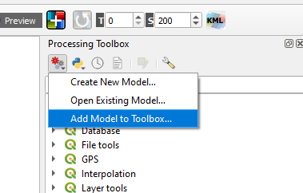

# kba-gis-tools

A project to share GIS tools for processing spatial data used in the identification of Key Biodiversity Areas. These tools work in [QGIS](https://qgis.org/) - a free and open source GIS application.

## Installation

Each tool is built as a [QGIS Model File](https://docs.qgis.org/3.40/en/docs/user_manual/processing/modeler.html), identified by the `.model3` extension. You can download individual models as you need, or the whole package using the `Download zip` option under `Code`. After downloading (and unzipping if necessary) you can add the tools to your QGIS toolbox by selecting `Models > Add Model to Toolbox`:

The model should then be available in your toolbox under the `Models` tab whenever you want to use it.

## Tool descriptions and use instructions

You can find descriptions of what each tool is doing and how to use them in the wiki.

## Comment, contribute or get help

Please post an [issue](https://github.com/lizevons/kba-gis-tools/issues) if you need help using any of these tools, or if you find any bugs or errors. Any suggestions for more tools are also welcome!
